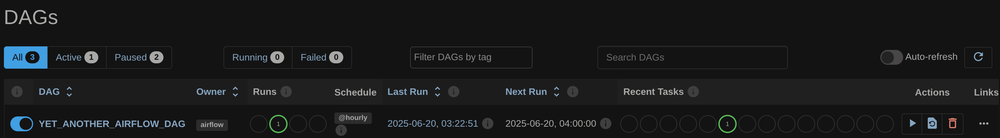

# ETL project(module 4)
## General
- За основу были взяты следующие датасеты:
    - [German used cars dataset](https://link-url-here.orghttps://www.kaggle.com/datasets/ander289386/cars-germany)
    - [USA used cars dataset](https://www.kaggle.com/datasets/austinreese/craigslist-carstrucks-data)
- Часть датасетов присутствует в репозитории:
    - autoscout24-germany-dataset.csv
    - part_of_vehicles.csv
## Task 1
- Были добавлены тестовые данные в таблицу (task_1/simple_insert.sql)
- Созданы трансферы:
    - 
    - 
    - 
    - 
## Task 2
- Cоздан DAG с запуском spark задания и pyspark скрипт, который в этом задании запускался
- Пришлось отказать от создания и удаления DataProcessing кластера в Dag'е(по не до конца понятным причинам код, который работал в д.з. перестал работать)
    - 
    - 
    - 
## Task 3
- Cозданы producer(task_3/write.py) и consumer(task_3/read.py)
    - 
## Task 4
- На основе загруженных данных был создан дашборд в DataLens со следующими чартами:
    - Распределение цен в зависимости от года выпуска
    - Распределение по маркам машин
    - Распределение по техническому наполнению(тип топлива + трансмиссии)
    - 
